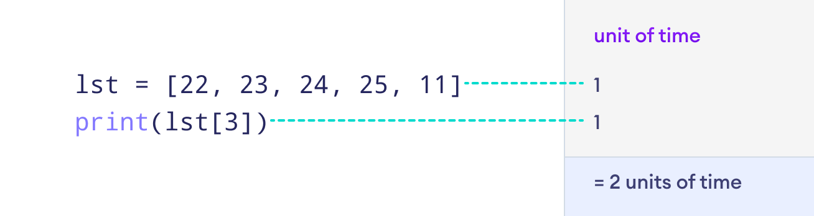
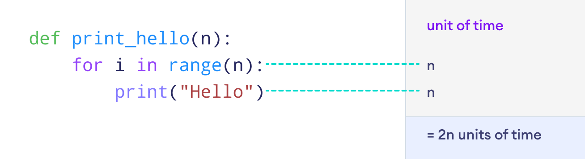
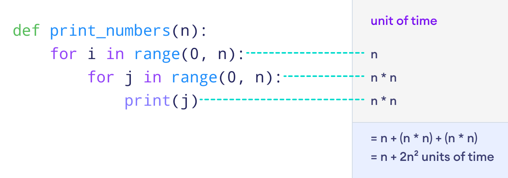
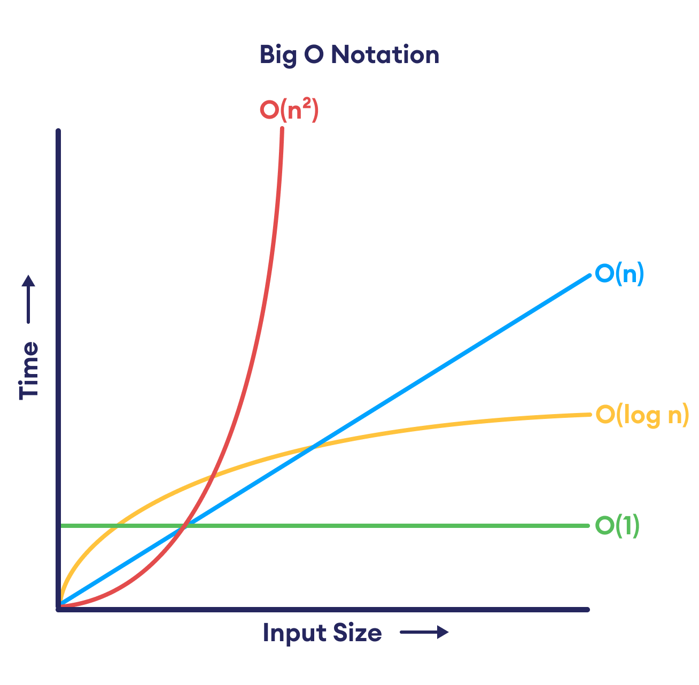

# *Analysis of Algorithms*

The analysis of algorithms involves studying the behavior of algorithms in terms of their resource usage. This analysis can be done in various ways, including:

- **Worst-case analysis:** This involves determining the maximum amount of resources an algorithm requires for any input of a given size. It provides an upper bound on the algorithm's performance.

- **Average-case analysis:** This involves determining the average amount of resources an algorithm requires for inputs of a given size. It provides a more realistic estimate of the algorithm's performance under typical conditions.

- **Best-case analysis:** This involves determining the minimum amount of resources an algorithm requires for inputs of a given size. It provides a lower bound on the algorithm's performance.
***

# *Complexity Calculation*

Complexity calculation refers to the analysis of the efficiency of algorithms. It involves determining how the resource requirements of an algorithm (such as time, space, or other resources) grow as the input size increases. This analysis helps in understanding and comparing the performance of different algorithms.

There are two main types of complexity calculations:

- **Time Complexity:** This measures the amount of time an algorithm takes to run with respect to the size of the input. It is usually expressed using Big O notation, which provides an upper bound on the running time in terms of the input size.

- **Space Complexity:** This measures the amount of memory space an algorithm requires as a function of the length of the input. It is also expressed using Big O notation, providing an upper bound on the memory usage.

By analyzing the complexity of algorithms, programmers can make informed decisions about which algorithm to use for a given problem based on factors such as input size, available memory, and desired performance.

***
# *Big O Notation*

Big O notation is a mathematical notation used to represent the time complexity of an algorithm.
- O(1) - Constant Time
- O(log n) - Logarithmic Time
- O(n) - Linear Time
- O(n^2) - Quadratic Time
- O(2^n) - Exponential Time

> ## **Constant Time Complexity**
- If the execution time of an algorithm is constant, it is said to have a time complexity of O(1).

- This means that the algorithm takes the same amount of time to run, regardless of the input size.
- Example: 
    - Accessing an element in an array by index has a time complexity of O(1).
    - Adding or removing an element from the beginning of a linked list has a time complexity of O(1).
    - Checking if a number is even or odd has a time complexity of O(1).
    - Finding the maximum or minimum element in an array has a time complexity of O(1).
    - Pushing or popping an element from a stack has a time complexity of O(1).
    
> ## **Linear Time Complexity**
- If the execution time of an algorithm is directly proportional to the input size, it is said to have a time complexity of O(n).

- This means that the algorithm's running time increases linearly with the input size.
- Example:
    - Linear search in an unsorted array has a time complexity of O(n).
    - Traversing all elements in a linked list has a time complexity of O(n).
    - Counting the number of occurrences of an element in an array has a time complexity of O(n).
    - Finding the sum of all elements in an array has a time complexity of O(n).
    - Copying elements from one array to another has a time complexity of O(n).
    
> ## **Quadratic Time Complexity**
- If the execution time of an algorithm is proportional to the square of the input size, it is said to have a time complexity of O(n^2).

- This means that the algorithm's running time increases quadratically with the input size.
- Quadratic time complexity is common in algorithms that involve nested loops.
- Example:
    - Bubble sort, selection sort, and insertion sort have a time complexity of O(n^2).
    - Checking if an array contains duplicate elements has a time complexity of O(n^2).
    - Generating all pairs of elements in an array has a time complexity of O(n^2).
    - Finding all possible combinations of elements in an array has a time complexity of O(n^2).
    - Calculating the determinant of a matrix using the cofactor expansion method has a time complexity of O(n^2).  

> ## **Logarithmic Time Complexity**
- If the execution time of an algorithm grows logarithmically with the input size, it is said to have a time complexity of O(log n).
- This means that the algorithm's running time increases slowly as the input size grows.
- Logarithmic time complexity is common in algorithms that divide the input in half at each step.
- Example:
    - Binary search in a sorted array has a time complexity of O(log n).
    - Finding the position of the most significant bit in a binary number has a time complexity of O(log n).
    - Calculating the exponentiation of a number using the binary exponentiation method has a time complexity of O(log n).
    - Finding the greatest common divisor of two numbers using the Euclidean algorithm has a time complexity of O(log n).
    - Calculating the Fibonacci number at a given position using the matrix exponentiation method has a time complexity of O(log n).
***
  
# Complexity Chart

- O(1) and O(log n) are considered efficient time complexities.
- O(n) is considered a moderate time complexity.
- O(n^2) and O(2^n) are considered inefficient time complexities.