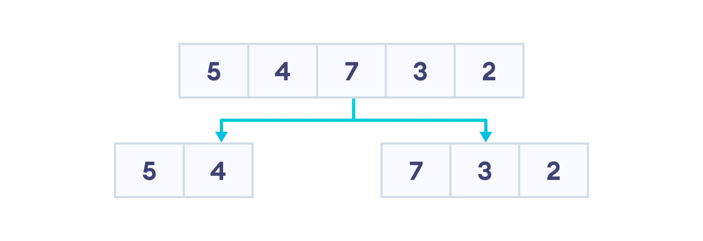
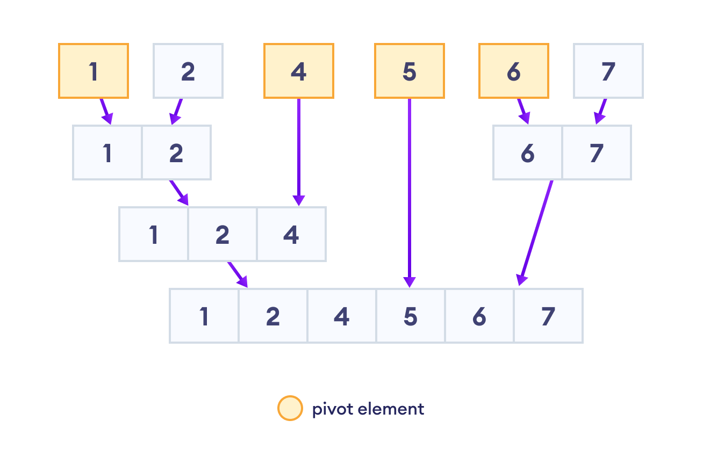
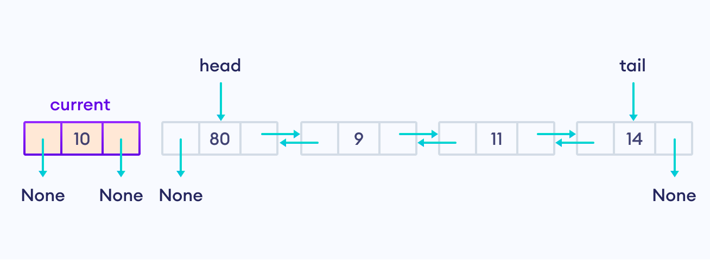
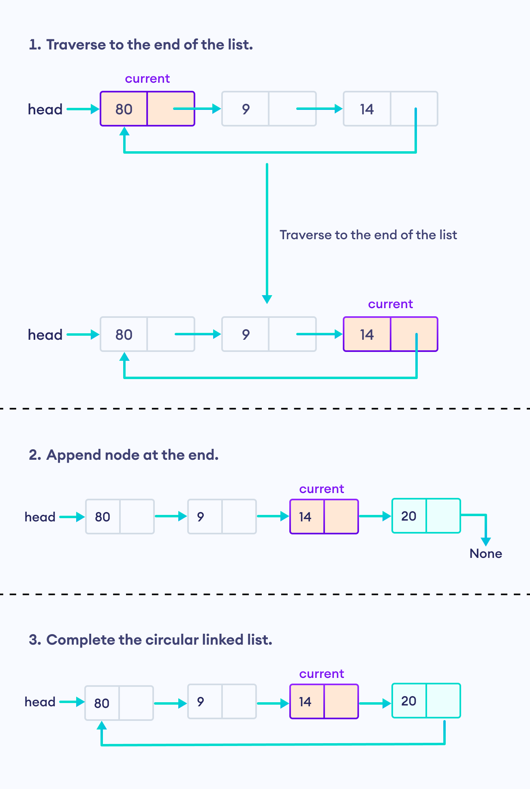
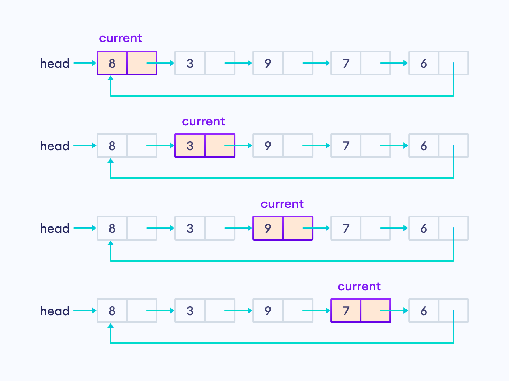
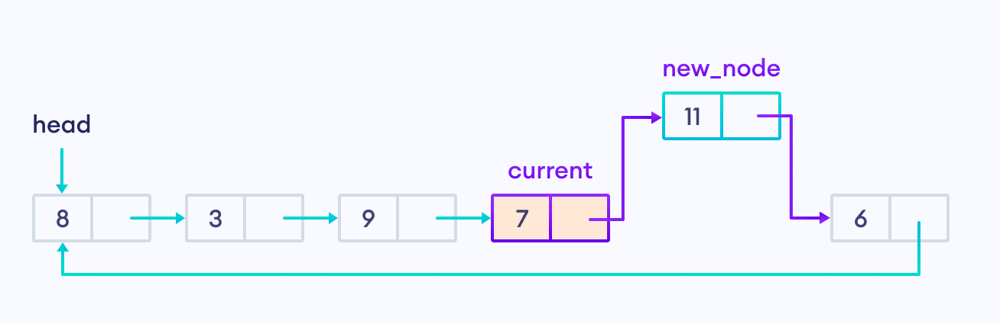
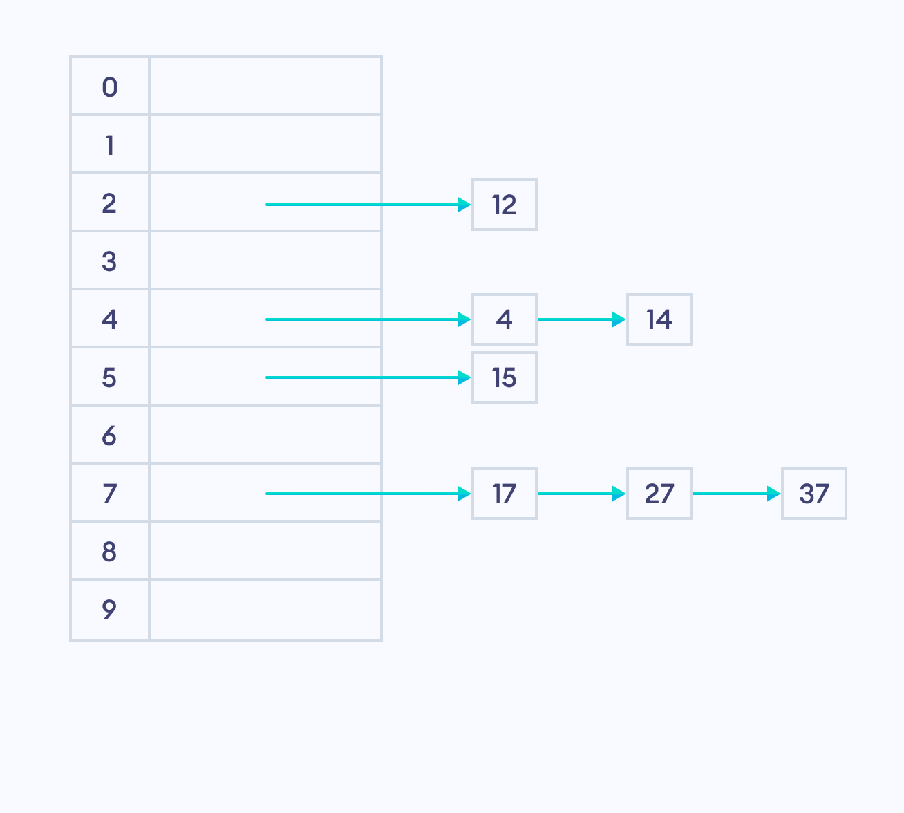
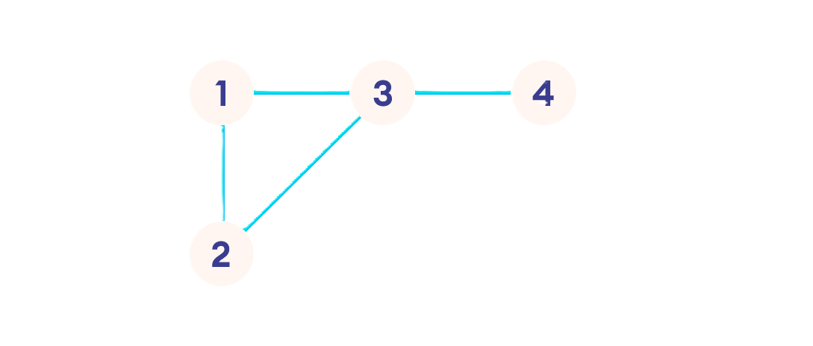

# *Data Structures and Algorithms*

- Data structures and algorithms (DSA) are fundamental concepts in computer science that enable efficient problem-solving. 
- Data structures are ways of organizing and storing data so that it can be accessed and modified efficiently. 
- Algorithms are step-by-step procedures for solving problems and performing computations.

    ## *Data Structures*
    - Data structures are used to store and organize data in a computer so that it can be used efficiently.
    - Some common data structures include arrays, linked lists, stacks, queues, trees, and graphs.

    ## *Algorithms*
    - Algorithms are step-by-step procedures for solving problems and performing computations.
    - Some common algorithms include sorting algorithms, searching algorithms, and graph algorithms.
***

# *Python Lists*
- Python lists are a type of data structure that can store multiple elements.
- Lists are mutable, which means that their elements can be changed after they are created.

    <details> 
    <summary> List  Slicing </summary>

    ## *List Slicing*
    - List slicing is a way to access a subset of elements from a list.
    - List slicing uses the syntax `list[start:end:step]` to specify the start index, end index, and step size.
    - ```python
        list = [1, 2, 3, 4, 5]
        print(list[1:4]) # Output: [2, 3, 4]
      ```
    ***
    </details>

    <details> 
    <summary> List Method </summary>

    ## *List Method*
    - Python lists have many built-in methods that can be used to modify and manipulate lists.
    - Some common list methods include `append()`, `extend()`, `insert()`, `remove()`, `pop()`, `index()`, `count()`, `sort()`, and `reverse()`.

      ### *List Append*
      - The `append()` method adds an element to the end of a list.
      - ```python
          list = [1, 2, 3]
          list.append(4)
          print(list) # Output: [1, 2, 3, 4]
        ```
      ---
      ### *List Extend*
      - The `extend()` method adds the elements of one list to the end of another list.
      - ```python
          list1 = [1, 2, 3]
          list2 = [4, 5, 6]
          list1.extend(list2)
          print(list1) # Output: [1, 2, 3, 4, 5, 6]
        ```
      ---
      ### *List Pop*
      - The `pop()` method removes and returns the element at a specified index.
      - ```python
          list = [1, 2, 3, 4]
          element = list.pop(2)
          print(element) # Output: 3
          print(list) # Output: [1, 2, 4]
        ```
      ---
      ### *List Insert*
      - The `insert()` method inserts an element at a specified index.
      - ```python
          list = [1, 2, 3, 4]
          list.insert(2, 5)
          print(list) # Output: [1, 2, 5, 3, 4]
        ```
      ---
      ### *List Remove*
      - The `remove()` method removes the first occurrence of a specified element from a list.
      - ```python
          list = [1, 2, 3, 4, 3]
          list.remove(3)
          print(list) # Output: [1, 2, 4, 3]
        ```
      ---
      ### *List Index*
      - The `index()` method returns the index of the first occurrence of a specified element in a list.
      - ```python
          list = [1, 2, 3, 4]
          index = list.index(3)
          print(index) # Output: 2
        ```
      ---
      ### *List Count*
      - The `count()` method returns the number of occurrences of a specified element in a list.
      - ```python
          list = [1, 2, 3, 4, 3]
          count = list.count(3)
          print(count) # Output: 2
        ```
      ---
      ### *List Sort*
      - The `sort()` method sorts the elements of a list in ascending order.
      - ```python
          list = [3, 1, 4, 1, 5, 9, 2, 6, 5]
          list.sort()
          print(list) # Output: [1, 1, 2, 3, 4, 5, 5, 6, 9]
        ```
      ---
      ### *List Reverse*
      - The `reverse()` method reverses the order of the elements in a list.
      - ```python
          list = [1, 2, 3, 4]
          list.reverse()
          print(list) # Output: [4, 3, 2, 1]
        ```
***
</details>

# *Sorting*

- Sorting is the process of arranging elements in a list in a specific order.
- There are many different sorting algorithms that can be used to sort a list of elements.

  <details>
  <summary> Bubble Sort </summary>
  
  ## *Bubble Sort*
  - Bubble sort is a simple sorting algorithm that repeatedly steps through the list, compares adjacent elements, and swaps them if they are in the wrong order.
  - The algorithm continues to pass through the list until no swaps are needed, indicating that the list is sorted.
  - Bubble sort has a time complexity of O(n^2) in the worst case.
  - Bubble sort space complexity is O(1).
  - Bubble sort is not a practical sorting algorithm for large lists.
  - *[Code](Code/Sorting/Bubble_Sort.py)*
  
  
  ***
  </details>
  
  <details>
  <summary> Selection Sort </summary>

  ## *Selection Sort*
  - Selection sort is a simple sorting algorithm that repeatedly selects the minimum element from an unsorted portion of the list and swaps it with the first unsorted element.
  - The algorithm divides the list into a sorted and an unsorted portion, with the sorted portion growing from left to right.
  - Selection sort has a time complexity of O(n^2) in the worst case.
  - Selection sort space complexity is O(1).
  - Selection sort is not a practical sorting algorithm for large lists.
  - *[Code](Code/Sorting/Selection_Sort.py)*
  
  
  ***
  </details>
  
  <details>
  <summary> Insertion Sort </summary>

  ## *Insertion Sort*
  - Insertion sort is a simple sorting algorithm that works by building a sorted list one element at a time.
  - The algorithm iterates over the list, removing one element at a time and inserting it into its correct position in the sorted portion of the list.
  - Insertion sort has a time complexity of O(n^2) in the worst case.
  - Insertion sort space complexity is O(1).
  - Insertion sort is efficient for small lists or nearly sorted lists.
  - *[Code](Code/Sorting/Insertion_Sort.py)*
  
  
  ***
  </details>

  <details>
  <summary> Merge Sort </summary>

  ## *Merge Sort*
  - Merge sort is a divide-and-conquer sorting algorithm that recursively divides the list into smaller sublists, sorts the sublists, and then merges them back together.
  - The algorithm uses a "merge" operation to combine two sorted sublists into a single sorted list.
  - Merge sort has a time complexity of O(n log n) in the worst case.
  - Merge sort space complexity is O(n).
  - Merge sort is a stable sorting algorithm that is efficient for large lists.
  - *[Code](Code/Sorting/Merge_Sort.py)*
  
  
  
  
  - ***Working of  Code***
  
  ***
  </details>

  <details>
  <summary> Quick Sort </summary>

  ## *Quick Sort*
  - Quick sort is a divide-and-conquer sorting algorithm that recursively divides the list into smaller sublists, sorts the sublists, and then combines them back together.
  - The algorithm uses a "pivot" element to partition the list into two sublists, with elements less than the pivot on one side and elements greater than the pivot on the other side.
  - Quick sort has a time complexity of O(n log n) in the average case and O(n^2) in the worst case.
  - Quick sort space complexity is O(log n).
  - Quick sort is an efficient sorting algorithm that deals with diverse data.
  - *[Code](Code/Sorting/Quick_Sort.py)*
  
  
  
  
  ***
  </details>

  <details>
  <summary> Counting Sort </summary>

  ## *Counting Sort*
  - Counting sort is a non-comparison-based sorting algorithm that works by counting the number of occurrences of each element in the list.
  - The algorithm then uses this information to construct a sorted list.
  - Counting sort has a time complexity of O(n + k) in the best and average cases and O(n + k) in the worst case, where k is the range of the input.
  - Counting sort space complexity is O(n + k).
  - Counting sort is efficient for sorting lists with a small range of integers and non-negative values.
  - *[Code](Code/Sorting/Counting_Sort.py)*
  
  
  
  ***
  </details>

  <details>
  <summary> Radix Sort </summary>

  ## *Radix Sort*
  - Radix sort is a non-comparison-based sorting algorithm that works by sorting elements based on their individual digits.
  - The algorithm sorts the elements by processing the digits from the least significant digit to the most significant digit.
  - Radix sort has a time complexity of O(nk) in the best and average cases and O(nk) in the worst case, where k is the number of digits in the input.
  - Radix sort space complexity is O(n + k).
  - Radix sort is efficient for sorting lists of integers with a fixed number of digits.
  - *[Code](Code/Sorting/Radix_Sort.py)*
  
  
  
  ***
  </details>

  <details>
  <summary> Bucket Sort </summary>

  ## *Bucket Sort*
  - Bucket sort is a sorting algorithm that divides the list into a number of buckets, each of which is then sorted individually.
  - The sorted buckets are then concatenated to produce the final sorted list.
  - Bucket sort has a time complexity of O(n^2) in the worst case and O(n + k) in the average case, where k is the number of buckets.
  - Bucket sort space complexity is O(n + k).
  - Bucket sort is efficient for sorting lists with a uniform distribution of elements.
  - *[Code](Code/Sorting/Bucket_Sort.py)*
  
  ***
  </details>

  <details>
  <summary> Shell Sort </summary>

  ## *Shell Sort*
  - Shell sort is a sorting algorithm that works by comparing elements that are a certain distance apart and then reducing the distance between elements to be compared.
  - The algorithm uses a sequence of gap values to determine the distance between elements.
  - Shell sort has a time complexity of O(n) in the best case and O(n∗(log(n)) ^2 in the worst case.
  - Shell sort space complexity is O(1).
  - Shell sort is an efficient sorting algorithm for small lists.
  - *[Code](Code/Sorting/Shell_Sort.py)*
     
  ***
  </details>
***
</details>

# *Searching*

- Searching is the process of finding a specific element in a list.
- There are many different searching algorithms that can be used to search for an element in a list.

  <details>
  <summary> Linear Search </summary>

  ## *Linear Search*
  - Linear search is a simple searching algorithm that sequentially checks each element in a list until the target element is found.
  - The algorithm has a time complexity of O(n) in the worst case, where n is the number of elements in the list.
  - Linear search is inefficient for large lists but works well for unsorted lists.
  - *[Code](Code/Searching/Linear_Search.py)*
  
  ***
  </details>

  <details>
  <summary> Binary Search </summary>

  ## *Binary Search*
  - Binary search is a searching algorithm that works by repeatedly dividing the list in half and comparing the target element with the middle element.
  - The algorithm requires the list to be sorted in ascending order.
  - Binary search has a time complexity of O(log n) in the worst case, where n is the number of elements in the list.
  - Binary search is efficient for large lists and works well for sorted lists.
  - *[Code](Code/Searching/Binary_Search.py)*
  
  
  
  ***
  </details>
***

# *Linked List*

- A linked list is a data structure that consists of a sequence of elements, where each element points to the next element in the sequence.
- Linked lists are dynamic data structures that can grow or shrink in size during program execution.
- Every element of a linked list is called a "node" and contains two parts: data and a reference to the next node in the sequence.
- Linked lists can be singly linked, doubly linked, or circular linked.

  <details>
  <summary> Singly Linked List </summary>

  ## *Singly Linked List*
  - A singly linked list is a type of linked list where each node points to the next node in the sequence.
  - The last node in the list points to a null reference.
  - Singly linked lists can be used to implement stacks, queues, and other data structures.
  - *[Code](Code/LinkedList/Singly_Linked_List.py)*
  
 

  ### *Singly Linked List Operations*
  
  - **Insertion**
    - *[Code](Code/LinkedList/Insertion_Singly_Linked_List.py)*
    <details>
    <summary> Insertion at the beginning of the list </summary>

    - Time Complexity: O(1)
      
      
    </details>

    <details>
    <summary> Insertion at the end of the list </summary>

    - Time Complexity: O(n)
      
    </details>

    <details>
    <summary> Insertion at a specific position in the list </summary>

    - Time Complexity: O(n)
      
      
    </details>
  ---
  - **Deletion**
    - *[Code](Code/LinkedList/Deletion_Singly_Linked_List.py)*
    <details>
    <summary> Deletion at the beginning of the list </summary>

    - Time Complexity: O(1)
      
    </details>
    
    <details>
    <summary> Deletion at the end of the list </summary>

    - Time Complexity: O(n)
    </details>

    <details>
    <summary> Deletion at a specific position in the list </summary>

    - Time Complexity: O(n)
      
    </details>
  </details>

  <details>
  <summary> Doubly Linked List </summary>

  ## *Doubly Linked List*
  - A doubly linked list is a type of linked list where each node points to both the next and previous nodes in the sequence.
  - The first node in the list points to a null reference, and the last node points to a null reference.
  - Doubly linked lists can be used to implement stacks, queues, and other data structures.
  - *[Code](Code/LinkedList/Doubly_Linked_List.py)*
  

  ### *Doubly Linked List Operations*

  - **Insertion**
    - *[Code](Code/LinkedList/Insertion_Doubly_Linked_List.py)*
    <details>
    <summary> Insertion at the beginning of the list </summary>

    - Time Complexity: O(1)
      
      
    </details>

    <details>
    <summary> Insertion at the end of the list </summary>

    - Time Complexity: O(n)
      
      
    </details>

    <details>
    <summary> Insertion at a specific position in the list </summary>

    - Time Complexity: O(n)
      
      
    </details>
  ---
  - **Deletion**
    - *[Code](Code/LinkedList/Deletion_Doubly_Linked_List.py)*
    <details>
    <summary> Deletion at the beginning of the list </summary>

    - Time Complexity: O(1)
      
    </details>

    <details>
    <summary> Deletion at the end of the list </summary>

    - Time Complexity: O(n)
      
    </details>

    <details>
    <summary> Deletion at a specific position in the list </summary>

    - Time Complexity: O(n)
      
      
    </details>

  </details>

  <details>
  <summary> Circular Linked List </summary>
  
  ## *Circular Linked List*
  - A circular linked list is a type of linked list where the last node points back to the first node in the sequence.
  - Circular linked lists can be used to implement circular buffers, scheduling algorithms, and other data structures.
  - *[Code](Code/LinkedList/Circular_Linked_List.py)*
  

  ### *Circular Linked List Operations*

  - **Insertion**
    - *[Code](Code/LinkedList/Insertion_Circular_Linked_List.py)*
    <details>
    <summary> Insertion at the beginning of the list </summary>

    - Time Complexity: O(1)
      
    </details>

    <details>
    <summary> Insertion at the end of the list </summary>

    - Time Complexity: O(n)
      
    </details>

    <details>
    <summary> Insertion at a specific position in the list </summary>

    - Time Complexity: O(n)
      
      
    </details>
  ---
  - **Deletion**
    - *[Code](Code/LinkedList/Deletion_Circular_Linked_List.py)*
    <details>
    <summary> Deletion at the beginning of the list </summary>

    - Time Complexity: O(1)
      
      
    </details>

    <details>
    <summary> Deletion at the end of the list </summary>

    - Time Complexity: O(n)
      <!--  -->
    </details>

    <details>
    <summary> Deletion at a specific position in the list </summary>

    - Time Complexity: O(n)
      
      
    </details>
  </details>
***

# *Stack*

- A stack is a data structure that stores elements in a last-in, first-out (LIFO) order.
- Stacks can be implemented using arrays or linked lists.
- Stacks are used in many applications, such as function call management, expression evaluation, and backtracking algorithms.
- All stack operations have a time complexity of O(1).

  <details>
  <summary>Stack Operations</summary>

  ## *Stack Operations*
  - **Push**
    - The `push()` operation adds an element to the top of the stack.
    

  - **Pop**
    - The `pop()` operation removes and returns the element at the top of the stack.

  - **Peek**
    - The `peek()` operation returns the element at the top of the stack without removing it.

  - **isFull**
    - The `isFull()` operation checks if the stack is full.

  - **Size**
    - The `size()` operation returns the number of elements in the stack. 
  </details>
--- 

# *Queue*

- A queue is a data structure that stores elements in a first-in, first-out (FIFO) order.
- Queues can be implemented using arrays or linked lists.
- Queues are used in many applications, such as task scheduling, breadth-first search, and printer spooling.
- All queue operations have a time complexity of O(1).

  <details>
  <summary>Queue Operations</summary>

  ## *Queue Operations*
  - **Enqueue**
    - The `enqueue()` operation adds an element to the back of the queue.
    
  - **Dequeue**
    - The `dequeue()` operation removes and returns the element at the front of the queue.

  - **Peek**
    - The `peek()` operation returns the element at the front of the queue without removing it.

  - **isEmpty**
    - The `isEmpty()` operation checks if the queue is empty.

  - **Size**
    - The `size()` operation returns the number of elements in the queue. 
  </details>

---

# *Circular Queue*

- A circular queue is a data structure that stores elements in a circular order.
- Circular queues can be implemented using arrays or linked lists.
- Circular queues are used in many applications, such as CPU scheduling, memory management, and disk scheduling.

  <details>
  <summary>Circular Queue Operations</summary>

  ## *Circular Queue Operations*
  - **Enqueue**
    - The `enqueue()` operation adds an element to the back of the queue.
    
  - **Dequeue**
    - The `dequeue()` operation removes and returns the element at the front of the queue.

  - **Peek**
    - The `peek()` operation returns the element at the front of the queue without removing it.

  - **isFull**
    - The `isFull()` operation checks if the queue is full.

  - **isEmpty**
    - The `isEmpty()` operation checks if the queue is empty.

  - **Size**
    - The `size()` operation returns the number of elements in the queue. 
  </details>
---

# *Hashing*

- Hashing is the process of transforming a key into a hash value using a hash function.
- Hashing is used to store and retrieve data in a data structure called a hash table.
- Hash tables are used in many applications, such as database indexing, caching, and password storage.
- *[Code](Code/Hashing/Hashing.py)*

  <details>
  <summary>Hash Function</summary>

  ## *Hash Function*
  - A hash function is a function that takes an input (or "key") and returns a fixed-size value (or "hash value").
  - Hash functions are used to map keys to hash values in a hash table.
  - A good hash function should be deterministic, efficient, and distribute keys evenly across the hash table.
  ---
  </details>
  <details>
  <summary>Hash Table</summary>

  ## *Hash Table*
  - A hash table is a data structure that stores key-value pairs in an array.
  - Hash tables use a hash function to map keys to hash values, which are used to index the array.
  - Hash tables are used to implement associative arrays, sets, and other data structures.

  ### *Hash Table Operations*
  
  - **Insert**
    - The `insert()` operation adds a key-value pair to the hash table.

  - **Search**
    - The `search()` operation retrieves the value associated with a key in the hash table.
  
  - **Delete**
    - The `delete()` operation removes a key-value pair from the hash table.
  ---
  </details>

  <details>
  <summary>Hashing Collision</summary>  

  ## *Hashing Collision*
  - Hashing collision occurs when two or more keys map to the same hash value in a hash table.
  - Collision resolution techniques are used to handle collisions and ensure that keys are stored and retrieved correctly.

  ### *Collision Resolution Techniques*

  <details>
  <summary>Chaining</summary>

  - **Chaining**
    - Chaining is a collision resolution technique that uses linked lists to store key-value pairs with the same hash value.
    - Chaining has a time complexity of O(1) for insert, search, and delete operations.
    - Chaining is efficient for large hash tables and handles collisions well.
    - *[Code](Code/Hashing/Chaining.py)*
    
    
  </details>

  <details>
  <summary>Linear Probing</summary>

  - **Linear Probing**
    - Linear probing is an open addressing technique that resolves collisions by searching for the next available slot in the hash table.
    - Linear probing has a time complexity of O(1) for insert and search operations and O(n) for delete operations.
    - Linear probing is efficient for small hash tables but may lead to clustering.
    - *[Code](Code/Hashing/Linear_Probing.py)*
    
    
  </details>

  <details>
  <summary>Quadratic Probing</summary>
  
  - **Quadratic Probing**
    - Quadratic probing is an open addressing technique that resolves collisions by using a quadratic function to search for the next available slot in the hash table.
    - Quadratic probing has a time complexity of O(1) for insert and search operations and O(n) for delete operations.
    - Quadratic probing is efficient for small hash tables but may lead to clustering.
    - *[Code](Code/Hashing/Quadratic_Probing.py)*
  </details>

  <details>
  <summary>Double Hashing</summary>  

  - **Double Hashing**  
    - Double hashing is an open addressing technique that resolves collisions by using a second hash function to search for the next available slot in the hash table.
    - Double hashing has a time complexity of O(1) for insert and search operations and O(n) for delete operations.
    - Double hashing is efficient for small hash tables and avoids clustering.
    - *[Code](Code/Hashing/Double_Hashing.py)*
  </details>

  <details>
  <summary>Rehashing</summary>

  - **Rehashing**
    - Rehashing is a technique that increases the size of the hash table and rehashes all key-value pairs when the load factor exceeds a certain threshold.
    - Rehashing reduces the likelihood of collisions and improves the performance of the hash table.
    - *[Code](Code/Hashing/Rehashing.py)*
    
  </details>
  
  ---
  </details>
---

# *String Matching Algorithms*

- String matching algorithms are used to find the occurrence of a pattern within a text.
- There are many different string matching algorithms that can be used to search for a pattern in a text.

  <details>
  <summary>Brute Force Algorithm</summary>

  ## *Brute Force Algorithm*
  - The brute force algorithm is a simple string matching algorithm that compares the pattern with substrings of the text.
  - The algorithm slides the pattern over the text one character at a time and checks for a match.
  - The brute force algorithm has a time complexity of O(mn) in the worst case, where m is the length of the pattern and n is the length of the text.
  - The brute force algorithm is inefficient for large texts and patterns.
  - *[Code](Code/String_Matching/Brute_Force.py)*
  
  
  
  ---
  </details>

  <details>
  <summary>Rabin-Karp Algorithm</summary>

  ## *Rabin-Karp Algorithm*
  - The Rabin-Karp algorithm is a string matching algorithm that uses hashing to compare the pattern with substrings of the text.
  - The algorithm computes the hash value of the pattern and compares it with the hash value of substrings of the text.
  - The Rabin-Karp algorithm has a time complexity of O(mn) in the worst case, where m is the length of the pattern and n is the length of the text.
  - The Rabin-Karp algorithm is efficient for large texts and patterns.
  - *[Code](Code/String_Matching/Rabin_Karp.py)*
  


***

# *Tree*
- A tree is a non linear data structure that consists of nodes connected by edges.
- Trees are used to represent hierarchical relationships between elements.
- Relationships between nodes in a tree are defined by parent-child relationships.
- The top node in a tree is called the root node, and nodes without children are called leaf nodes.

- Trees can be used to implement binary search trees, expression trees, and other data structures.

<details>
<summary> Depth of a Node </summary>

## *Depth of a  Node*
  - The depth of a node is the number of edges from the root to the node.
  
---
</details>

<details>
<summary> Height of a Node </summary>

## *Height of a Node*
- The height of a node is the number of edges on the longest path from the node to a leaf.
  
---
</details>

<details>
<summary> Degree of a Node </summary>

## *Degree of a Node*
  - The degree of a node is the number of children of the node.
  
---
</details>

<details>
<summary> Level of a Node </summary>

## *Level of a Node*
  - The level of a node is the depth of the node.
  
  ---
</details>


<details>
<summary> Tree Traversal </summary>

## *Tree Traversal*
- Tree traversal is the process of visiting all the nodes in a tree in a specific order.
- There are three main types of tree traversal: in-order, pre-order, and post-order.
- Tree traversal can be implemented using recursion or iteration.

  <details>
  <summary> Pre-Order Traversal </summary>

  ### *Pre-Order Traversal*
  - In pre-order traversal, the root node is visited first, followed by the left subtree and then the right subtree.
  - Pre-order traversal is used to create a copy of the tree and prefix expressions.
  - *[Code](Code/Trees/Traversal.py)*
  
  ---
  </details>

  <details>
  <summary> Post-Order Traversal </summary>

  ### *Post-Order Traversal*
  - In post-order traversal, the left subtree is visited first, followed by the right subtree and then the root node.
  - Post-order traversal is used to delete the tree and postfix expressions.
  - *[Code](Code/Trees/Traversal.py)*
  
  ---
  </details>

  <details>
  <summary> In-Order Traversal </summary>

  ### *In-Order Traversal*
  - In in-order traversal, the left subtree is visited first, followed by the root node and then the right subtree.
  - In-order traversal is used to get elements in non-decreasing order and infix expressions.
  - *[Code](Code/Trees/Traversal.py)*
  ---
  </details>
  
  <details>
  <summary> Level-Order Traversal </summary>

  ### *Level-Order Traversal*
  - In level-order traversal, nodes are visited level by level, starting from the root node.
  - Level-order traversal is used to print the tree level by level.
  - *[Code](Code/Trees/Traversal.py)*
  
  ---
  </details>
---
</details>

<details>
<summary> Binary Tree </summary>

## *Binary Tree*
- A binary tree is a tree data structure in which each node has at most two children, referred to as the left child and the right child.
- Binary trees can be used to implement binary search trees, expression trees, and other data structures.
- For level d, the maximum number of nodes is 2^d and the minimum number of nodes is d+1.
- For height h, the maximum number of nodes is 2^(h+1) - 1 and the minimum number of nodes is h+1.
- *[Code](Code/Trees/BinaryTree/Binary_Tree.py)*


  <details>
  <summary> Binary Tree Traversal </summary>

  ### *Binary Tree Traversal*
  - Binary tree traversal is the process of visiting all the nodes in a binary tree in a specific order.
  - There are same as tree traversal: in-order, pre-order, post-order, and level-order.
  - *[Code](Code/Trees/BinaryTree/Traversal.py)*
  ---
  </details>

  <details>
  <summary> Types of Binary Trees </summary>

  ### *Types of Binary Trees*
  - There are many different types of binary trees that have specific properties and characteristics.
  - Some common types of binary trees include full binary trees, complete binary trees, perfect binary trees, and balanced binary trees.

  <details>
  <summary> Full Binary Tree </summary>

  ### *Full Binary Tree*
  - A full binary tree is a binary tree in which each node has either zero or two children.
  - Full binary trees are also known as proper binary trees.
  - For height h, the maximum number of nodes is 2^(h+1) - 1, and the minimum number of nodes is h+1.
  - Similarly, the maximum number of leaf nodes is 2^h, and the minimum number of leaf nodes is h+1
  - *[Code](Code/Trees/BinaryTree/Full_Binary_Tree.py)* 
  
  ---
  </details>

  <details>
  <summary> Complete Binary Tree </summary>

  ### *Complete Binary Tree*
  - A complete binary tree is a binary tree in which all levels are completely filled except possibly for the last level, which is filled from left to right.
  - Complete binary trees are used in heap data structures and priority queues.
  - For height h, the maximum number of nodes is 2^h, and the minimum number of nodes is 2^(h-1).
  - *[Code](Code/Trees/BinaryTree/Complete_Binary_Tree.py)*
  
  ---
  </details>

  <details>
  <summary> Perfect Binary Tree </summary>

  ### *Perfect Binary Tree*
  - A perfect binary tree is a binary tree in which all levels are completely filled, and all leaf nodes are at the same level.
  - Perfect binary trees have 2^h leaf nodes, where h is the height of the tree.
  - Perfect binary trees are used in heap data structures and priority queues.
  - *[Code](Code/Trees/BinaryTree/Perfect_Binary_Tree.py)*
  
  ---
  </details>

---
</details>

<details>
<summary> Binary Search Tree </summary>

## *Binary Search Tree*
- A binary search tree (BST) is a binary tree in which each node has a key and satisfies the binary search tree property.
- Binary search trees can be used to implement efficient search, insert, and delete operations.

  <details>
  <summary> Binary Search Tree Property </summary>

  ### *Binary Search Tree Property*
  - The binary search tree property states that for every parent node:
    - The key of the left child is less than the key of the parent node.
    - The key of the right child is greater than the key of the parent node.
    - The binary search tree property holds for all nodes in the tree.
    
  ---
  </details>

  <details>
  <summary> Binary Search Tree Operations </summary>

  ### *Binary Search Tree Operations*

  - **Search**
    - The `search()` operation searches for a key in the binary search tree.
    - The time complexity of the search operation is O(h), where h is the height of the tree.
    - *[Code](Code/Trees/BinarySearchTree/BST.py)*

  - **Insert**
    - The `insert()` operation inserts a key into the binary search tree.
    - The time complexity of the insert operation is O(h), where h is the height of the tree.
    - *[Code](Code/Trees/BinarySearchTree/BST.py)*

  - **Delete**
    - The `delete()` operation deletes a key from the binary search tree.
    - The time complexity of the delete operation is O(h), where h is the height of the tree.
    - *[Code](Code/Trees/BinarySearchTree/BST.py)*
  </details>
---
</details>

---

# *Huffman Coding*
- Huffman coding is a lossless data compression algorithm that uses variable-length codes to represent characters in a text.
- Huffman coding is used in file compression, data transmission, and other applications.
- Huffman coding is based on the frequency of characters in the text.
- *[Code](Code/Huffman_Coding/Huffman_Coding.py)*
***

# *Heaps*
- A heap is a binary tree data structure that satisfies the heap property.
- Heaps can be used to implement priority queues, heap sort, and other data structures.
- For any node i, the parent node is at index (i-1)//2, the left child node is at index 2i+1, and the right child node is at index 2i+2.
- There are two main types of heaps: min heaps and max heaps.

<details>
<summary> Max Heap </summary>

## *Max Heap*
- A max heap is a binary tree data structure in which the value of each parent node is greater than or equal to the values of its children.
- The root node of a max heap contains the maximum value in the heap.
- *[Code](Code/Heaps/Max_Heap.py)*

</details>

<details>
<summary> Min Heap </summary>

## *Min Heap*
- A min heap is a binary tree data structure in which the value of each parent node is less than or equal to the values of its children.
- The root node of a min heap contains the minimum value in the heap.
- *[Code](Code/Heaps/Min_Heap.py)*

</details>

<details>
<summary> Heap Sort </summary>

## *Heap Sort*
- Heap sort is a comparison-based sorting algorithm that uses a binary heap data structure to sort elements in ascending order.
- The algorithm builds a max or min heap from the input list and repeatedly extracts the root node to create a sorted list.
- Heap sort has a time complexity of O(n log n) in the worst case.
- *[Code](Code/Heaps/Heap_Sort.py)*

</details>

<details>
<summary> Priority Queue </summary>

## *Priority Queue*
- A priority queue is a data structure that stores elements in a priority order.
- Priority queues can be implemented using heaps to efficiently insert and remove elements based on their priority.
- Priority queues are used in many applications, such as task scheduling, Dijkstra's algorithm, and Huffman coding.
- *[Code](Code/Heaps/Priority_Queue.py)*
</details>

***

# *Graph*
- A graph is a collection of nodes (vertices) and edges that connect pairs of nodes.
- Graphs can be used to represent relationships between elements in a network.
- Mathematically, a graph G is defined as a pair (V, E), where V is a set of vertices and E is a set of edges.


<details>
<summary> Graph Terminology </summary>

## *Graph Terminology*
- **Edge**
  - An edge is a connection between two vertices in a graph.
  - The edge can be directed or undirected, weighted or unweighted.
  - Directed edges have a direction, while undirected edges do not.
  - Weighted edges have a weight, while unweighted edges do not.
  ---

- **Vertex**
  - A vertex is a node in a graph.
  - Vertices can be connected by edges to form a graph.
  ---

- **Degree**
  - The degree of a vertex is the number of edges incident to the vertex.
  - In a directed graph, the in-degree is the number of incoming edges, and the out-degree is the number of outgoing edges.
  ---

- **Path**
  - A path is a sequence of vertices connected by edges.
  - The length of a path is the number of edges in the path.
  ---

- **Cycle**
  - A cycle is a path that starts and ends at the same vertex.
  - A graph with no cycles is called an acyclic graph.
---
</details>


<details>
<summary> Graph Representation </summary>

## *Graph Representation* 
- Graphs can be represented using 

  <details>
  <summary> Adjacency Matrix </summary>

  ### *Adjacency Matrix*
  - An adjacency matrix is a 2D array that stores the edges between vertices in a graph.
  - It is a matrix of zeros and ones, where a one indicates an edge between two vertices.
  - For a graph G = (V, E) with n vertices, the adjacency matrix is an n x n matrix given by:
    - A[i][j] = 1 if there is an edge between vertices i and j.
    - A[i][j] = 0 if there is no edge between vertices i and j.
  - *[Code](Code/Graphs/Adjacency_Matrix.py)*
  
  ---
  </details>

  <details>
  <summary> Adjacency List </summary>

  ### *Adjacency List*
  - An adjacency list is a collection of linked lists that stores the neighbors of each vertex in a graph.
  - Each vertex has a list of adjacent vertices that it is connected to.
  - For a graph G = (V, E) with n vertices, the adjacency list is a list of n linked lists.
  - *[Code](Code/Graphs/Adjacency_List.py)*
  
  
  ---
  </details>
---
</details>  


<details>
<summary> Graph Traversal </summary>

## *Graph Traversal*
- Graph traversal is the process of visiting all the vertices in a graph in a specific order.
- There are two main types of graph traversal: depth-first search (DFS) and breadth-first search (BFS).

  <details>
  <summary> Depth-First Search (DFS) </summary>

  ### *Depth-First Search (DFS)*
  - Depth-first search is a graph traversal algorithm that explores as far as possible along each branch before backtracking.
  - DFS uses a stack to keep track of vertices to visit.
  - DFS is used to find connected components, topological sorting, and other applications.
  - Time Complexity: O(V + E), where V is the number of vertices and E is the number of edges.
  - *[Code](Code/Graphs/DFS.py)*
  
  ---
  </details>

  <details>
  <summary> Breadth-First Search (BFS) </summary>

  ### *Breadth-First Search (BFS)*
  - Breadth-first search is a graph traversal algorithm that explores all the vertices at the current depth before moving to the next depth.
  - BFS uses a queue to keep track of vertices to visit.
  - BFS is used to find the shortest path, connected components, and other applications.
  - Time Complexity: O(V + E), where V is the number of vertices and E is the number of edges.
  - *[Code](Code/Graphs/BFS.py)*
  
  
  ---
  </details>
---
</details>

<details>
<summary> Graph Algorithms </summary>

## *Graph Algorithms*
- Graph Algorithms are used to solve problems on graphs, such as finding the shortest path, detecting cycles, and finding connected components.

  <details>
  <summary> Topological Sorting </summary>

  ### *Topological Sorting*
  - Topological sorting is used to order the vertices in a directed acyclic graph (DAG) such that for every directed edge uv, vertex u comes before vertex v in the ordering.
  - Topological sorting is used in task scheduling, job sequencing, and other applications.
  - Time Complexity: O(V + E) where V is the number of vertices and E is the number of edges.
  - *[Code](Code/Graphs/Topological_Sorting.py)*
  
  
  ---
  </details>

  <details>
  <summary> Dijkstra's Algorithm </summary>

  ### *Dijkstra's Algorithm*
  - Dijkstra's algorithm is used to find the shortest path from a source vertex to all other vertices in a weighted graph.
  - Dijkstra's algorithm uses a priority queue to keep track of the vertices to visit.
  - Dijkstra's algorithm works for graphs with non-negative edge weights.
  - Time Complexity: O(V log V + E) where V is the number of vertices and E is the number of edges.
  - *[Code](Code/Graphs/Dijkstra.py)*
  
  
  ---
  </details>

  <details>
  <summary> Bellman-Ford Algorithm </summary>

  ### *Bellman-Ford Algorithm*
  - Bellman-Ford algorithm is used to find the shortest path from a source vertex to all other vertices in a weighted graph.
  - Bellman-Ford algorithm works for graphs with negative edge weights and detects negative cycles.
  - Bellman-Ford algorithm uses dynamic programming to find the shortest path.
  - Time Complexity: O(V * E) where V is the number of vertices and E is the number of edges.
  - *[Code](Code/Graphs/Bellman_Ford.py)*
  ---
  </details>

  <details>
  <summary> Ford Fulkerson Algorithm </summary>

  ### *Ford Fulkerson Algorithm*
  - Ford Fulkerson algorithm is used to find the maximum flow in a flow network.
  - Ford Fulkerson algorithm uses the residual graph to find augmenting paths.
  - Ford Fulkerson algorithm works for graphs with capacities on edges.
  - Time Complexity: O(C * E) where C is the maximum flow and E is the number of edges.
  - *[Code](Code/Graphs/Ford_Fulkerson.py)*
  ---
  </details>
  
  <details>
  <summary> Kruskal's Algorithm </summary>

  ### *Kruskal's Algorithm*
  - Kruskal's algorithm is used to find the minimum spanning tree of a connected, undirected graph.
  - Kruskal's algorithm uses a greedy approach to find the minimum spanning tree in a weighted graph with positive edge weights.
  - Kruskal's algorithm works by adding edges in increasing order of weight until all vertices are connected.
  - Time Complexity: O(E log E) where E is the number of edges.
  - *[Code](Code/Graphs/Kruskal.py)*
  
  
  ---
  </details>

  <details>
  <summary> Prim's Algorithm </summary>

  ### *Prim's Algorithm*
  - Prim's algorithm is used to find the minimum spanning tree of a connected, undirected graph.
  - Prim's algorithm uses a greedy approach to find the minimum spanning tree in a weighted graph with positive edge weights.
  - Prim's algorithm works by adding vertices in increasing order of weight until all vertices are connected.
  - Time Complexity: O(V^2) where V is the number of vertices.
  - *[Code](Code/Graphs/Prim.py)*
  ---
  </details>
</details>

---

# *Balanced Binary Tree*
- A balanced binary tree is a binary tree in which the height of the left and right subtrees of any node differ by at most one.
- Balanced binary trees are used in AVL trees, red-black trees, and other self-balancing trees.
- Balanced binary trees have a height of O(log n), where n is the number of nodes in the tree.
- Balancing factors are used to determine the balance of a binary tree.
- *Balancing factors =  height of left subtree - height of right subtree*
- *[Code](Code/Trees/BinaryTree/Balanced_Binary_Tree.py)*


## *Rotations*
- Rotations are used to balance binary trees by changing the structure of the tree.
- There are two main types of rotations: left rotations and right rotations.
- Rotations are used in AVL trees, red-black trees, and other self-balancing trees.
  
<details>
<summary> Right Rotation </summary>

### *Right Rotation*
- A right rotation is used to balance a binary tree by rotating the nodes to the right.
- They are used mainly on trees having Left-Left (LL) unbalanced patterns.

---
</details>

<details>
<summary> Left Rotation </summary>

### *Left Rotation*
- A left rotation is used to balance a binary tree by rotating the nodes to the left.
- They are used mainly on trees having Right-Right (RR) unbalanced patterns.

---
</details>

<details>
<summary> Left-Right Rotation </summary>

### *Left-Right Rotation*
- A left-right rotation is used to balance a binary tree by rotating the nodes to the left and then to the right.
- They are used mainly on trees having Left-Right (LR) unbalanced patterns.

--- 
</details>

<details>
<summary> Right-Left Rotation </summary>

### *Right-Left Rotation*
- A right-left rotation is used to balance a binary tree by rotating the nodes to the right and then to the left.
- They are used mainly on trees having Right-Left (RL) unbalanced patterns.

---
</details>

---
</details>

# *AVL Tree*
- An AVL tree is a self-balancing binary search tree in which the height of the left and right subtrees of any node differ by at most one.
- AVL trees are used to maintain the balance of binary search trees during insertions and deletions.
- AVL trees have a height of O(log n), where n is the number of nodes in the tree.
- AVL trees use rotations to balance the tree and maintain the AVL property.
- *[Code](Code/Trees/BinaryTree/AVL_Tree.py)*


---

# *Red-Black Tree*
