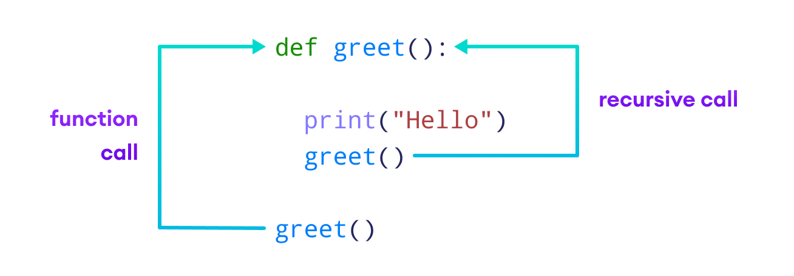
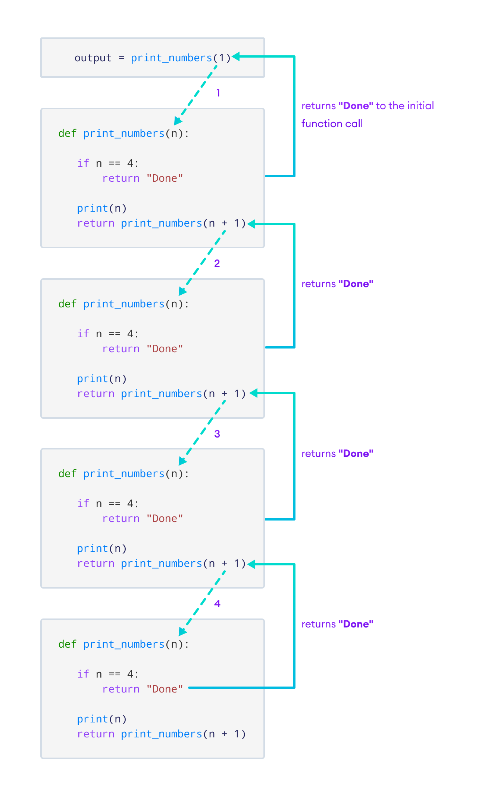

# *Recursion*

## What is Recursion?
Recursion is a method where the solution to a problem depends on solutions to smaller instances of the same problem.

## How does Recursion work?
Recursion works by breaking down a problem into smaller, more manageable problems. It then solves each of these smaller problems and combines the results.
Recursion uses stack memory to store the intermediate results.




## Base Case
The base case is the condition that stops the recursion. It is the condition that is used to terminate the recursion.

```python
def print_numbers(n):
    if n == 4:
        return "Done"   
    print(n)
    return print_numbers(n + 1)
 
output = print_numbers(1)
print(output)
```

